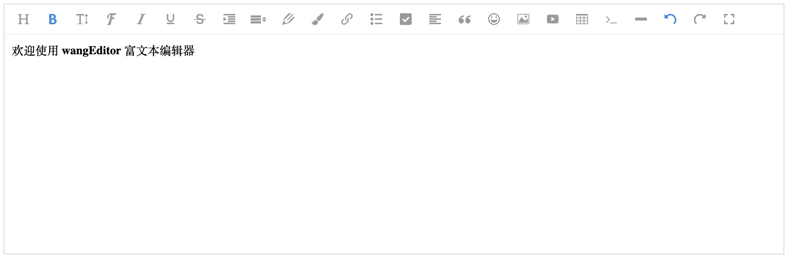

# 介绍

[**English documentation**](https://www.wangeditor.com/doc-en/)

**wangEditor** —— 轻量级 web 富文本编辑器，配置方便，使用简单。

- 官网：[www.wangEditor.com](https://www.wangeditor.com/)
- 文档：[www.wangeditor.com/doc](https://www.wangeditor.com/doc/)
- 源码：[github.com/wangeditor-team/wangEditor](https://github.com/wangeditor-team/wangeditor) （欢迎 star）



_（如想继续使用 `V3` 版本，可参考[这里](/pages/01-开始使用/08-使用V3版本.html)）_

# demo

在线体验 demo 可到 [codepen.io/collection/DNmPQV](https://codepen.io/collection/DNmPQV) 。

注意，如果打不开，可以去查看 [github examples](https://github.com/wangeditor-team/wangEditor/tree/master/examples) 的源码。

# 浏览器兼容性

兼容常见的 PC 浏览器：Chrome，Firefox，Safari，Edge，QQ 浏览器，IE11。

不支持移动端。

# 基本使用

## NPM

```bash
npm i wangeditor --save
```

安装后几行代码即可创建一个编辑器：

```js
import E from "wangeditor"
const editor = new E("#div1")
editor.create()
```

## CDN

```html
<script
  type="text/javascript"
  src="https://cdn.jsdelivr.net/npm/wangeditor@latest/dist/wangEditor.min.js"
></script>
<script type="text/javascript">
  const E = window.wangEditor
  const editor = new E("#div1")
  // 或者 const editor = new E(document.getElementById('div1'))
  editor.create()
</script>
```

更多使用方法，可参考[开始使用](/pages/01-开始使用/)，或者看左侧目录。

# 交流

加入 QQ 群

- 164999061（人已满）
- 710646022（人已满）
- 901247714

提交 bug 或建议

- [github issues](https://github.com/wangeditor-team/wangeditor/issues) 提交问题

# 贡献代码

欢迎非团队成员贡献代码，提交 Pull Request，请一定参考 [贡献代码流程](https://github.com/wangeditor-team/wangEditor/blob/master/docs/contribution.md)。

# 开发人员

- [王福朋](https://github.com/wangfupeng1988/) - wangEditor 创始人，资深前端工程师，PMP，曾就职于百度、滴滴
- [太阳](http://info.tt2.ink/) - 佛系前端工程师~
- [刘威](https://github.com/q378532364) - 我已经想到了一个完美实现 execCommand api 的方法可是这里太小写不下。
- [童汉](http://www.itonghan.com/) - 星火世传 奋飞不辍
- [李春淋](https://blog.csdn.net/qq_39235055) - 只要不放弃努力和追求，小草也有点缀春天价值。
- [郑温剑](https://github.com/xiaokyo) - 放弃很容易，但是坚持会更酷。
- [方智聪](https://github.com/clinfc) - 翠林
- [张超](https://github.com/zhangporco)
- [bella](https://github.com/qiaoqiaotu)
- [罗超](https://github.com/echoLC) - 天才就是百分之一的灵感加上百分之九十九的努力。
- [haha](https://github.com/hahaaha)
- [李宁](https://github.com/lnimpossible) - 一切皆有可能。
- [饶思羚](https://github.com/rsl140)
- [颜彪](https://github.com/86driver) - 大家好，我是二号男嘉宾，我的交友宣言是爱我爱我爱我把，选我选我选我吧
- [刘庆华(火热)](https://github.com/liuqh0609) - 热爱着，年轻着
- [李晨](https://github.com/lichenabson)
- [顾乾峰](https://juejin.cn/user/976022056999944) - 一条喜欢撸码也喜欢打游戏的咸鱼，是真努力还是假努力，时间会检验一切！
- [郑越冕](https://juejin.cn/user/3069492197592781)
- [Gavin(杨浩)](https://github.com/Gavin-yh)
- [史莱姆](https://github.com/shi-lai-mu)

想加入 wangEditor 研发团队，可申请加入 QQ 群，然后私聊群主。
