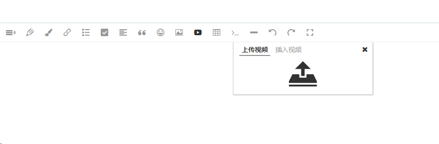

# 配置服务端接口

`v4.6.3` 开始支持上传视频。

【注意】如果上传视频遇到问题，请打开浏览器开发者工具，查看 `console.error` 输出的错误信息。

## 配置接口

```js
const E = window.wangEditor
const editor = new E('#div1')

// 配置 server 接口地址
editor.config.uploadVideoServer = '/api/upload-video'

editor.create()
```

配置完成之后，编辑器的视频菜单，会显示上传视频的 tab 和图标，如下图。



## server 接口返回格式，重要！！！

接口要返回 `application/json` 格式，格式要求如下：

```js
{
    // errno 即错误代码，0 表示没有错误。
    //       如果有错误，errno != 0，可通过下文中的监听函数 fail 拿到该错误码进行自定义处理
    "errno": 0,

    // data 是一个对象，返回视频的线上地址
    "data": {
        "url": "视频1地址",
    }
}
```
